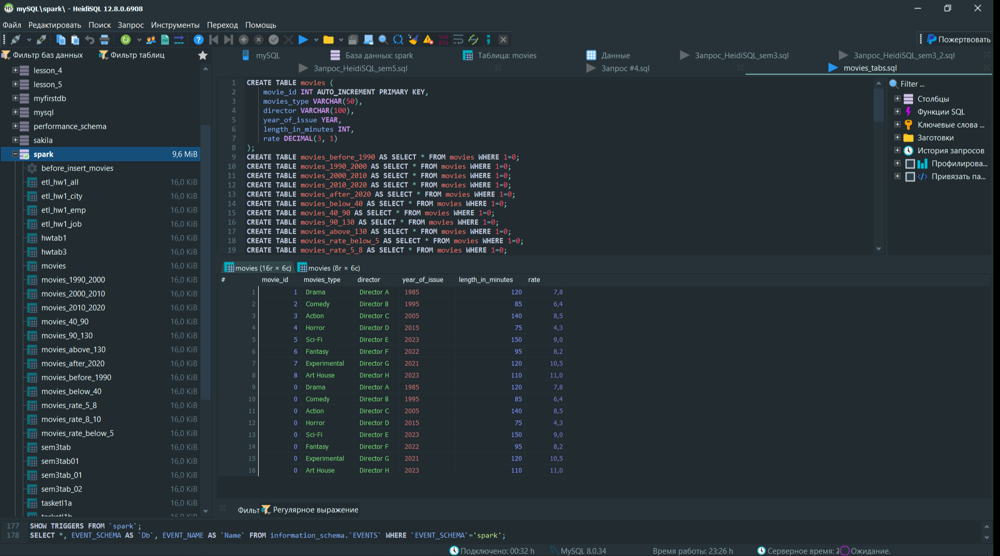

## Домашняя работа 4

### За основу возьмите Задание 4 решенное на семинаре.
В файле s4_2 параметры кредита: Займ 9400000, срок 30 лет, ставка 10.6%.
Через https://calcus.ru/kreditnyj-kalkulyator-s-dosrochnym-pogasheniem добавьте два листа в Excel с постоянным платежом 120 или 250 тыс. руб.
Добавьте графики с досрочным погашением по этим пирометрам. Т.е. линии по выплатам основного долга и процентов если платеж будет 120 или 250 тыс. руб. В результате должно получиться 6 линий. Используйте разные цвета.

### Данные подгружаем в наш файл s4_2.xlsx c сайта. Преобразовываем(убираем лишнее в названии) и загружаем полученную таблицу в Haidi.SQL

### При поможи языка SQL применим код для получения требуемых данных в файле Credit120K.sql

### Задание 2 
### Партицирование данных по дате. Динамическое партицирование
### При поможи языка SQL применим код для получения требуемых данных в файле movies_tabs.sql
1. Создайте таблицу movies с полями movies_type, director, year_of_issue, length_in_minutes, rate.

2. Сделайте таблицы для горизонтального партицирования по году выпуска (до 1990, 1990 -2000, 2000- 2010, 2010-2020, после 2020).

3. Сделайте таблицы для горизонтального партицирования по длине фильма (до 40 минута, от 40 до 90 минут, от 90 до 130 минут, более 130 минут).

4. Сделайте таблицы для горизонтального партицирования по рейтингу фильма (ниже 5, от 5 до 8, от 8до 10).

5. Создайте правила добавления данных для каждой таблицы.

6. Добавьте фильмы так, чтобы в каждой таблице было не менее 3 фильмов.

7. Добавьте пару фильмов с рейтингом выше 10.

8. Сделайте выбор из всех таблиц, в том числе из основной.

9. Сделайте выбор только из основной таблицы.

