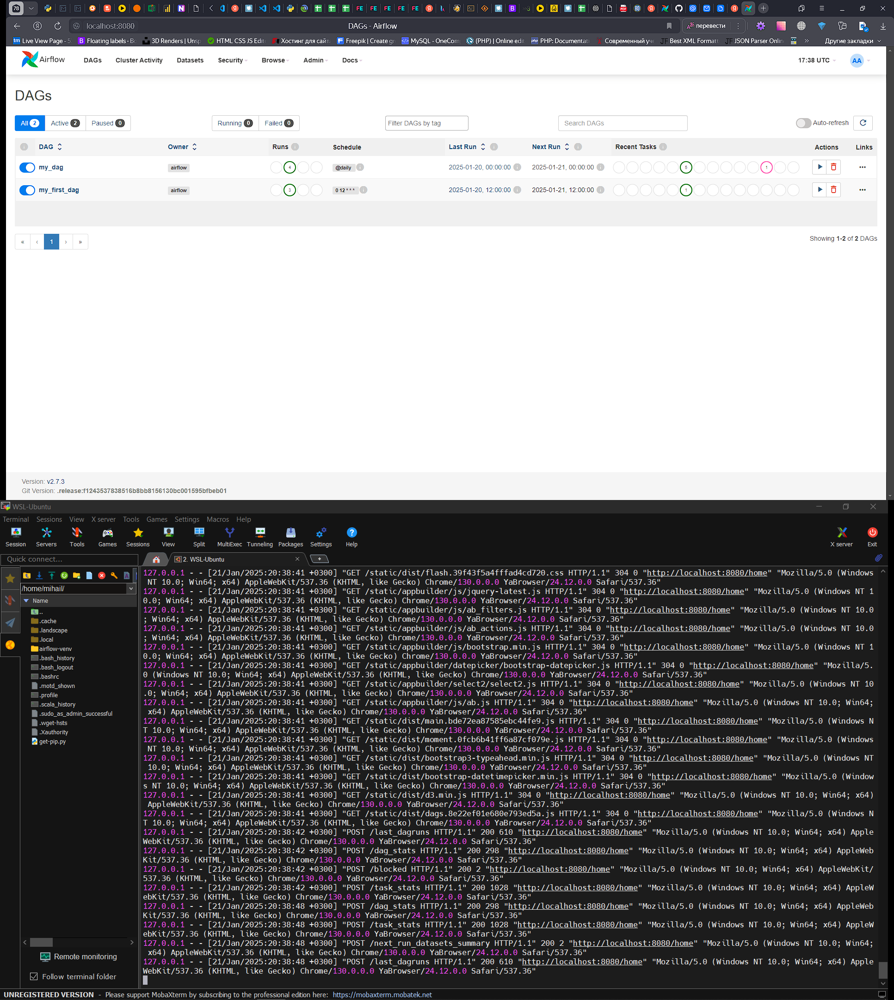

### Урок 5. Обзор возможностей Airflow, установка и настройка

##Домашнее задание
##Установите аирфлоу как показано на семинаре, соберите список команд установки, скриншоты GUI и
##работы аирфлоу из мобы. Соберите все данные в один pdf файл.

1. Скачайте файл my_first_dag.py, поместите его в папку airflow/dags. Перезапустите airflow и запустите этот dag.

2. Посмотрите логи вывода.

3. Измените этот dag так, чтобы он выводил в консоль текст «Привет + ваше имя». Посмотрите в логах, что dag выводит
то, что вы хотите.

4. Скачайте файл my_second_dag.py поместите его в папку airflow/dags.

5. Объясните, что происходит в рамках этого процесса.

